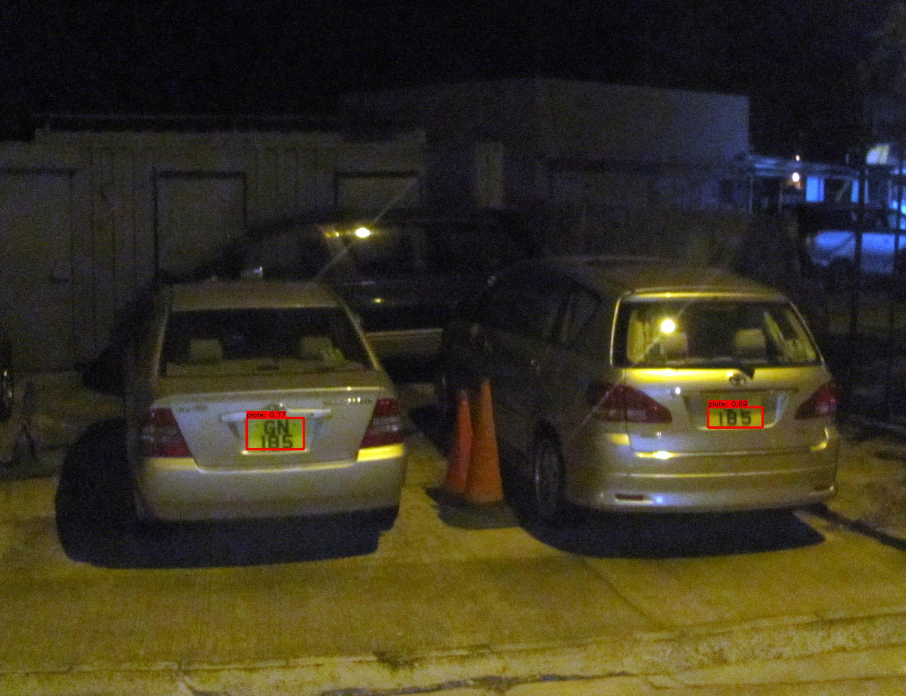
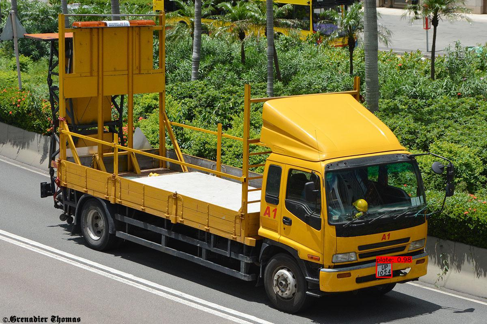

# YOLOv3 for Automatic License Plate Recognition (ALPR)
This is an implementation of YunYang1994's excellent TensorFlow implementation of YOLOv3, [found here](https://github.com/YunYang1994/tensorflow-yolov3), with specific utilities and modifications for dealing with detecting the location of license plates in images.

This was tested on a dataset of approximately 400 images of Hong Kong license plates, with transfer learning with apretrained model trained on the COCO dataset, and 95% of the bounding boxees were correct, even with a confidence cut-off of 20%.

It works pretty well in low light AND with skewed license plates too:

